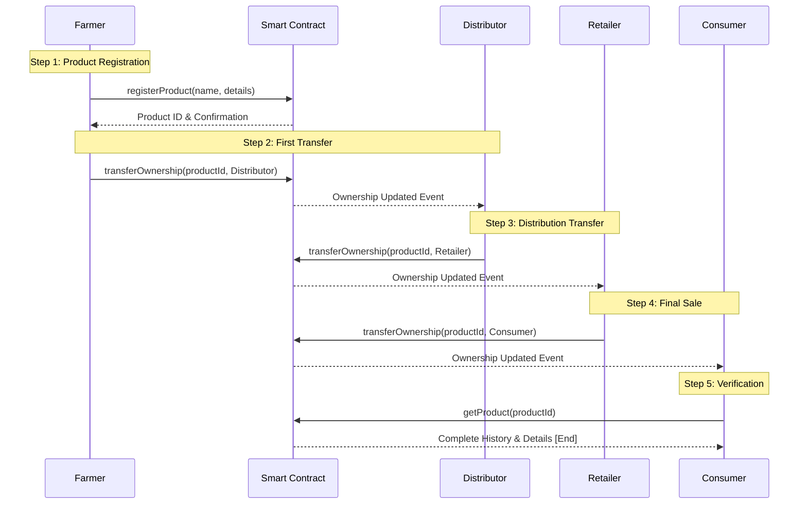

# Crop Chain 🌱⛓️

A decentralized application (dApp) built on the Ethereum blockchain to bring transparency, traceability, and efficiency to the agricultural supply chain.

## Overview

Crop Chain is a smart contract-based solution that tracks the journey of agricultural products from the farm to the consumer. By leveraging blockchain technology, it creates an immutable and transparent record of every step in the supply chain, helping to:

*   **Build Trust:** Consumers can verify the origin and journey of their food.
*   **Improve Traceability:** Quickly pinpoint the source of contamination or quality issues.
*   **Empower Farmers:** Give farmers a verifiable record of their produce.
*   **Reduce Fraud:** Prevent counterfeit products and false claims.

## Features

*   **Product Registration:** Farmers can register new batches of produce on the blockchain.
*   **Ownership Tracking:** Each transfer of custody (from farmer to distributor, distributor to retailer, etc.) is recorded as a transaction.
*   **Immutable History:** Once a step is logged, it cannot be altered or deleted, ensuring data integrity.
*   **User-Friendly Interface:** A React-based frontend to interact with the smart contracts easily.

## Technology Stack

*   **Blockchain:** Ethereum
*   **Smart Contracts:** Solidity
*   **Web3 Library:** Ethers.js
*   **Frontend Framework:** React.js
*   **Development Framework:** Hardhat
*   **Testing:** Hardhat Network / Mocha

## Getting Started

### Prerequisites

*   [Node.js](https://nodejs.org/) (v16 or higher)
*   [npm](https://www.npmjs.com/) or [yarn](https://yarnpkg.com/)
*   A MetaMask wallet browser extension.

### Installation & Local Development

1.  **Clone the repository:**
    ```bash
    git clone https://github.com/naveen-2111-dev/crop-chain.git
    cd crop-chain
    ```

2.  **Install Backend Dependencies:**
    ```bash
    cd ethereum
    npm install
    ```

3.  **Compile Smart Contracts:**
    ```bash
    npx hardhat compile
    ```

4.  **Run Tests:**
    ```bash
    npx hardhat test
    ```

5.  **Deploy to Local Blockchain:**
    ```bash
    npx hardhat node
    ```
    In a separate terminal, run:
    ```bash
    npx hardhat run --network localhost scripts/deploy.js
    ```
    Copy the deployed contract address for the frontend.

6.  **Install and Run Frontend:**
    ```bash
    cd ../client
    npm install
    ```
    Update the contract address and ABI in the frontend configuration.
    ```bash
    npm start
    ```
    The app will open in your browser at `http://localhost:3000`.

## Usage

1.  **Connect Wallet:** Open the dApp and connect your MetaMask wallet to the local Hardhat network.
2.  **Register a Product:** As a Farmer, use the interface to register a new crop batch (e.g., "Organic Tomatoes").
3.  **View Product Info:** Search for a product by its ID to see its current owner and full history.
4.  **Transfer Product:** As the current owner, you can transfer the product to a new address (simulating a sale to a distributor or retailer).

## Smart Contract

The core logic is defined in `CropChain.sol` (or similar, based on your code). Key functions include:

*   `registerProduct(string memory _name, string memory _details)`
*   `getProduct(uint _productId)`
*   `transferOwnership(uint _productId, address _newOwner)`

## Contributing

Contributions are welcome! Please feel free to submit a Pull Request.

1.  Fork the Project
2.  Create your Feature Branch (`git checkout -b feature/AmazingFeature`)
3.  Commit your Changes (`git commit -m 'Add some AmazingFeature'`)
4.  Push to the Branch (`git push origin feature/AmazingFeature`)
5.  Open a Pull Request

## Project Flow Diagram

### High-Level System Architecture


  
    ### High-Level System Architecture
    
```mermaid

    flowchart TD
    Start[User Opens dApp] --> Connect[Connect MetaMask Wallet]
    Connect --> Home[Landing Page]
    
    Home --> RoleSelect{Select Role}
    
    RoleSelect -->|Farmer| FarmerFlow
    RoleSelect -->|Other User| ViewFlow
    
    subgraph FarmerFlow [Farmer Actions]
        F1[Register New Product] --> F2[Fill Product Details]
        F2 --> F3[Submit Transaction]
        F3 --> F4[Product Registered Event]
        F4 --> F5[Transfer to Distributor]
    end
    
    subgraph ViewFlow [Supply Chain View]
        V1[Enter Product ID] --> V2[Fetch Product History]
        V2 --> V3[Display Timeline]
        V3 --> V4[Verify Authenticity]
    end
    
    FarmerFlow --> Blockchain[(Ethereum<br/>Blockchain)]
    ViewFlow --> Blockchain
